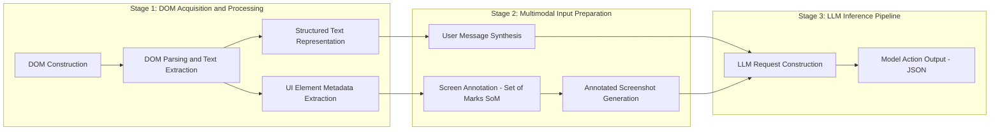

# BÁO CÁO KỸ THUẬT `@crab-agent`

## 1. Overview
`@crab-agent` gửi thông tin cho model theo **2 kênh**:

1. **Kênh chữ (DOM text)**
2. **Kênh ảnh (Vision + SoM)**: chỉ có khi bật vision và chụp màn hình thành công.

Đơn giản:
- `DOM text` = “bản mô tả chữ của màn hình hiện tại”.
- `elements` = “danh sách từng nút/ô nhập (có index, vị trí, thuộc tính)”.
- SoM = “ảnh chụp có vẽ khung + số index trùng với `elements`”.

## 2. Công nghệ sử dụng (chỉ `@crab-agent`)

| Nhóm | Công nghệ/Thành phần |
|---|---|
| Nền tảng | Chrome Extension Manifest V3 |
| Runtime | JavaScript thuần (`background.js`, `sidepanel.js`, `content.js`) |
| Browser APIs | `chrome.tabs`, `chrome.scripting`, `chrome.debugger`, `chrome.runtime`, `chrome.sidePanel`, `chrome.storage` |
| DOM parser | `lib/buildDomTree.js` |
| Vision/SoM | `captureVisibleTab` (PNG), `OffscreenCanvas`, `createImageBitmap` |
| Model providers | OpenAI/OpenAI-compatible, Anthropic, Google, OpenRouter, Ollama (gọi qua `fetch`) |
| Điều phối agent | Executor loop + Planner/Navigator + action handlers |

## 3. DOM text
## 3.1 Định nghĩa 
**DOM text** là một **chuỗi văn bản lớn** mô tả trạng thái trang hiện tại theo cách model đọc được nhanh:
- kích thước viewport,
- vị trí scroll,
- URL và title,
- danh sách phần tử tương tác (nút, link, input...) theo format `[index] <tag> ...`.

Bạn có thể hình dung nó là “**bảng mô tả thao tác**” gửi cho model trước khi model chọn hành động.

## 3.2 Ví dụ:
```text
[Viewport: 1465x845]
[Scroll: Y=0/3200]
[URL: https://misajsc.amis.vn/chat]
[Title: Chat]

Interactive Elements:
[5] <button> role="button" aria-label="Tạo mới" "+"
[9] <button> role="tab" "Nhóm"
[18] <input> placeholder="Tìm kiếm người, tin nhắn..." @(120,78)
[26] <button> role="button" "Tạo nhóm"
```

## 3.3 Model dùng `**DOM text** để làm gì?
- Chọn `click_element` theo **index** (ví dụ index 26).
- Phân biệt nhầm lẫn chức năng dựa trên `role`, `aria-label`, `placeholder`, text hiển thị.
- Xác định vị trí input (qua `@(x,y)`) khi cần fallback `click_at`.


## 4. Elements
`elements` là phiên bản **có cấu trúc** (dạng object) của danh sách phần tử tương tác.  
Nếu **DOM Text** là “bản mô tả đọc nhanh”, thì `elements` là “**bản đồ kỹ thuật chi tiết**”.

Ví dụ:
```json
[
  {
    "index": 26,
    "tagName": "button",
    "text": "Tạo nhóm",
    "attributes": {
      "role": "button",
      "aria-label": "Tạo nhóm"
    },
    "rect": { "x": 246, "y": 88, "width": 64, "height": 28 },
    "xpath": "/html/body/...",
    "isInteractive": true
  }
]
```

- `index`: mã số để model ra lệnh click (`click_element`).
- `text`: chữ nhìn thấy trên nút/ô.
- `attributes`: metadata giúp hiểu ý nghĩa control.
- `rect`: vị trí và kích thước trên màn hình.
- `isInteractive`: có phải phần tử thao tác được hay không.


## 5 SoM là gì và trông như nào?

SoM (Set-of-Mark) là ảnh screenshot đã vẽ:
- khung bao quanh phần tử tương tác,
- số `[index]` trên khung,
- số này **trùng** với `elements[index]`/dòng index trong **DOM text**.

Nói cách khác:
- **DOM text** cho model biết “index 26 là gì”.
- SoM cho model thấy “index 26 đang nằm ở đâu trên ảnh”.

## 6. Dữ liệu được truyền cho model như thế nào?

## 6.1 Luồng xử lý
1. Build DOM -> sinh **DOM text**. + **elements**.
2. Nếu bật vision: chụp screenshot PNG.
3. Dùng `elements.rect` để vẽ SoM lên ảnh.
4. Gửi message text chứa **DOM text**.
5. Nếu có ảnh thì attach ảnh SoM kèm message.
6. Model trả action JSON (`click_element`, `click_at`, `input_text`, ...).

## 6.2 Sơ đồ 



## 7. Khi nào chỉ truyền DOM? Khi nào DOM + SoM?

| Điều kiện | Dữ liệu gửi model |
|---|---|
| `useVision = false` | Chỉ DOM text (`textRepresentation`) |
| `useVision = true` + chụp ảnh thành công | DOM text + ảnh SoM |
| Trang bị hạn chế chụp (`chrome://`, `file://`, ...) hoặc capture fail | Fallback về DOM-only |

## 8. Lọc DOM

1. **Thu thập phần tử gốc**
- Quét toàn bộ DOM hiện tại (`querySelectorAll('*')`).
- Quét thêm trong Shadow DOM.
- Quét thêm iframe cùng domain (cross-origin thì bỏ qua).
- Giới hạn độ sâu đệ quy để tránh vòng lặp vô hạn.

2. **Bỏ các node không hữu ích**
- Bỏ tag kỹ thuật/không tương tác: `script`, `style`, `noscript`, `svg`, `path`, `meta`, `link`, `head`.
- Bỏ overlay do chính agent vẽ (để tránh tự đọc nhãn SoM của mình).

3. **Lọc hiển thị**
Một phần tử chỉ được giữ nếu “nhìn thấy được”:
- `display != none`
- `visibility != hidden`
- `opacity != 0`
- kích thước khác 0 (`width` hoặc `height` > 0)

4. **Lọc theo viewport (mặc định)**
- Chỉ giữ phần tử nằm trong vùng nhìn thấy hiện tại (viewport).
- Mục tiêu: giảm nhiễu và bám sát những gì model có thể thao tác ngay.

5. **Lọc tính tương tác**
Chỉ giữ phần tử có thể thao tác:
- tag form: `input`, `textarea`, `select`, `button`
- link `<a>` có `href`
- có `onclick`
- có role tương tác (`button`, `link`, `tab`, `textbox`, ...)
- `tabindex != -1`
- `contenteditable=true`
- hoặc có data-attr kiểu hành động (`data-action`, `ng-click`, ...)

6. **Gán index ổn định**
- Mỗi phần tử được gán `index` dựa trên chữ ký (tag + một số thuộc tính + xpath).
- Index cố giữ ổn định trong cùng URL/path để giảm “nhảy số” giữa các bước.

7. **Sinh 2 đầu ra**
- `elements`: danh sách object kỹ thuật.
- `DOM`: chuỗi text thân thiện cho model đọc.

Lí do cần lọc:
- Nếu gửi “toàn bộ HTML”, model sẽ nhiễu và tốn token.
- Lọc theo “nhìn thấy + tương tác được” giúp model tập trung vào mục tiêu thao tác.
- Kết hợp thêm SoM trên ảnh để model vừa có ngữ nghĩa (text) vừa có vị trí trực quan (image).

## 9. Kết luận
`@crab-agent` không gửi raw HTML toàn trang cho model. Hệ thống gửi:
- một lớp mô tả thao tác DOM,
- một lớp dữ liệu cấu trúc (`elements`),
- và thêm lớp thị giác SoM trên ảnh khi vision khả dụng.

Mô hình này là **DOM-first, vision-augmented**: ưu tiên index/metadata từ DOM và dùng SoM để neo vị trí trực quan, giảm sai thao tác trên UI động.